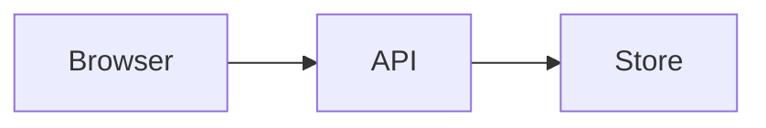

# Notes

Source for [crasnec.github.io](https://crasnec.github.io/), a static Astro blog
for long-form engineering notes.

The site includes:

- Markdown and MDX posts
- Syntax highlighting with Expressive Code
- Mermaid diagrams and KaTeX equations
- Categories, tags, archives, pagination, and a table of contents
- Pagefind full-text search
- Generated Open Graph images and favicons
- Author-encrypted posts
- Moderated comments stored in a separate GitHub repository
- Automatic deployment to GitHub Pages

## Requirements

- Node.js 22.12 or newer
- npm
- Git

## Local development

Install dependencies and fetch the comment store:

```bash
npm install
npm run comments:pull
```

Start Astro in background mode:

```bash
npm run astro -- dev --background
```

Manage the background server with:

```bash
npm run astro -- dev status
npm run astro -- dev logs
npm run astro -- dev stop
```

Useful checks:

```bash
npm run check      # Astro type checking, ESLint, and tests
npm run lint       # ESLint only
npm run lint:fix   # Apply safe ESLint fixes
npm test           # Node test suite
npm run build
npm run preview
```

TypeScript uses Astro's strictest configuration. ESLint applies type-aware
strict and stylistic rules to TypeScript, plus Astro and accessibility rules to
components. Security-sensitive Markdown and encryption boundaries have focused
tests. The deployment workflow runs the complete check before building.

`npm run build` creates the static site in `dist/` and then builds the Pagefind
index. Use `npm run build:clean` after changing a remark or rehype plugin, the
content schema, category definitions, or the active theme.

## Configuration

Site metadata, categories, navigation, profile information, and comment limits
live in [`src/config.ts`](src/config.ts).

The active visual theme is selected in
[`src/theme.config.mjs`](src/theme.config.mjs). Theme implementations live under
`src/styles/themes/`.

Copy `.env.example` to `.env` for local comment integration:

```dotenv
PUBLIC_COMMENTS_REPO=Crasnec/blog-comments
PUBLIC_COMMENTS_TOKEN=github_pat_...
```

Never commit `.env`.

The comment form remains visible but disabled until both values are configured.

## Writing posts

Posts live in `src/content/posts/`. Their full path below that directory becomes
the URL path, so nested directories are preserved.

```text
src/content/posts/databases/redis/cache-invalidation.md
https://crasnec.github.io/posts/databases/redis/cache-invalidation/
```

Frontmatter follows this schema:

```yaml
---
title: Cache invalidation without guesswork
published: 2026-08-22
updated: 2026-08-24
description: A short summary used in listings and metadata.
category: backend
tags: [caching, performance]
draft: false
---
```

`category` must be one of the keys defined in `src/config.ts`. Tags are
free-form. Drafts are visible during development and excluded from production
builds.

## Markdown features

Code fences support Expressive Code metadata:

````markdown
```ts title="cache.ts" {2-4}
export function read(key: string) {
  return cache.get(key);
}
```
````

Mermaid fences are rendered as diagrams:

````markdown

````

Admonitions use directives:

```markdown
:::warning
This operation cannot be undone.
:::
```

Supported kinds are `note`, `tip`, `important`, `warning`, and `caution`.
Inline and display mathematics are rendered with KaTeX.

## Locked posts

Locked post plaintext lives in the ignored `secrets/` directory. The committed
post contains only public frontmatter and encrypted content.

Create the keypair once:

```bash
npm run secret:keygen
```

Seal a post:

```bash
npm run secret:seal secrets/private-note.md
```

Open a sealed post for editing:

```bash
npm run secret:open src/content/posts/private/private-note.md
```

Change the passphrase without resealing posts:

```bash
npm run secret:rekey
```

The passphrase is never committed. Losing it makes existing locked posts
unrecoverable.

## Comments

Comments are stored in the public
[`Crasnec/blog-comments`](https://github.com/Crasnec/blog-comments) repository.
The browser dispatches its `comment.yml` workflow, which validates the input and
commits a JSON record with `approved: false`.

Only approved comments are rendered. To publish one, change `approved` to
`true` in the comment repository and commit the change. The next scheduled site
build fetches the store and includes it in the static output.

The comment token is intentionally included in the generated page. It must be a
fine-grained token restricted to `Crasnec/blog-comments` with only
**Actions: read and write**. This still exposes that repository's Actions API to
abuse, so the repository boundary and minimal permission scope are mandatory.

Comment bodies support a restricted Markdown subset. Raw HTML, images, and
unsafe links are removed or neutralized before rendering.

## Deployment

The source repository is private. The workflow in
`.github/workflows/deploy.yml` builds the site and pushes only `dist/` to the
public [`Crasnec/crasnec.github.io`](https://github.com/Crasnec/crasnec.github.io)
repository.

The workflow runs:

- after pushes to `main`
- on manual dispatch
- once per hour to publish newly approved comments

Required Actions secrets in `Crasnec/blog`:

- `PAGES_DEPLOY_KEY`: SSH key used only to publish generated files
- `PUBLIC_COMMENTS_TOKEN`: fine-grained token for the comment workflow

The deployment fails when `PUBLIC_COMMENTS_TOKEN` is missing, preventing a site
with a silently disabled comment form from being published.

## Project structure

```text
.github/workflows/  Build and deployment automation
keys/               Public key and passphrase-wrapped private key
scripts/            Comment sync and locked-post tools
src/components/     Reusable Astro components
src/content/        Posts and standalone pages
src/layouts/        Site and article layouts
src/pages/          Astro routes
src/plugins/        Markdown processing plugins
src/scripts/        Browser-side behavior
src/styles/         Layout, prose, motion, and themes
src/utils/          Content, URL, rendering, and cryptography helpers
src/views/          Shared page views
```

Generated or private directories such as `dist/`, `.astro/`, `.comments/`,
`node_modules/`, `secrets/`, and `.env` are ignored by Git.
