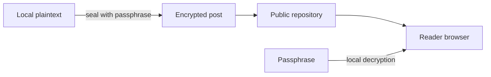

A static blog can still support private writing and reader responses. This site treats both as optional layers around the public Markdown workflow, with clear boundaries between source code, secrets, and user-submitted data.

## Private posts are encrypted first

A private post begins as a local Markdown file under `secrets/`. The sealing command encrypts its body and creates a publishable post containing only public metadata and ciphertext.

```bash
npm run secret:seal -- secrets/example.md
```

The plaintext file is ignored by Git. The passphrase is never written to the generated post or included in the deployed site. In the browser, a reader enters the passphrase and the article is decrypted locally.



:::caution
Encryption protects the article body, not its metadata. The title, date, category, tags, and approximate ciphertext size remain public.
:::

## Comments live outside the site source

Comments are stored as JSON files in a separate public GitHub repository. The browser submits a comment by dispatching a narrowly scoped GitHub Actions workflow. The site fetches approved files during its next build.

That separation keeps generated discussion data out of the blog's source history. It also makes the comment system disposable: the data repository can be replaced without rewriting the site.

New submissions begin with `approved: false`. A maintainer reviews the generated JSON and changes the value to `true` before the comment can appear. The production site never renders unapproved entries.

## Enable only what you need

Public posts work without either feature. To enable comments, configure the comment repository and its token in the deployment environment. To publish a private article, seal one local source file. There is no database or always-on server to operate.

:::note
Static comments are not instant. A newly approved comment appears after the next site build, which is a deliberate tradeoff for a smaller and more auditable system.
:::

The full setup, security boundaries, and maintenance commands are documented in the project README.
