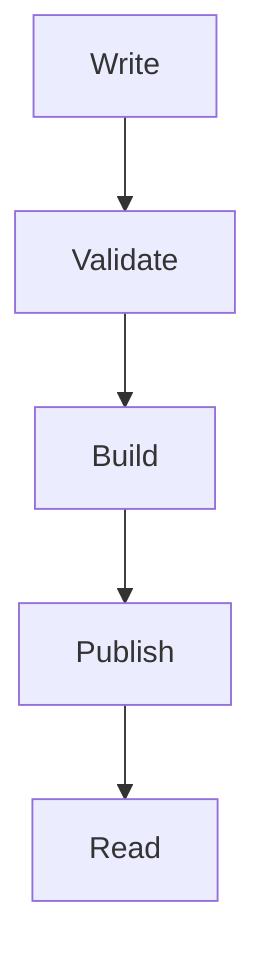

The writing system extends Markdown in a few deliberate ways. The additions are useful for technical articles, but the source remains readable without the site running.

## Code that carries context

Fenced blocks use Expressive Code for syntax highlighting. Add a title when the filename matters, and highlight the lines that deserve attention.

```ts title="src/lib/greeting.ts" {2}
export function greeting(name: string) {
  return `Hello, ${name}.`;
}
```

Inline code such as `npm run build` remains visually distinct without interrupting the paragraph.

## Callouts for important details

Container directives create consistent callout blocks:

:::note
Use a note for helpful context that is not part of the main argument.
:::

:::tip
Use a tip for a practical shortcut or recommendation.
:::

:::caution
Use caution when ignoring this detail could produce a surprising result.
:::

## Diagrams close to the explanation

Mermaid diagrams live in the same file as the prose, which keeps them easy to revise when the explanation changes.



The diagram is redrawn when the site theme changes so its colors remain legible.

## Tables and mathematics

Tables are wrapped for horizontal scrolling on narrow screens:

| Feature | Source | Result |
| --- | --- | --- |
| Code | Fenced block | Highlighted listing |
| Diagram | Mermaid fence | Responsive SVG |
| Math | TeX notation | KaTeX output |
| Callout | Container directive | Styled notice |

Inline mathematics uses dollar signs, such as $E = mc^2$. Display equations use a separate block:

$$
T(n) = O(n \log n)
$$

## Standard Markdown still works

Block quotes, ordered and unordered lists, task lists, links, images, and footnotes are all available.[^source]

- Keep the source easy to scan.
- Use richer elements only when they clarify the idea.
- Prefer accessible labels over decorative captions.

MDX adds components and JavaScript expressions on top of the same foundation. Rename a post to `.mdx` when that extra capability is genuinely needed; no other publishing step changes.

[^source]: These features are processed at build time and included in the generated HTML.
