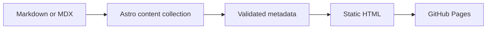

This is a small publishing system for technical writing. It is built with Astro, rendered as a static site, and designed to keep the words in focus.

The project started with a simple question: how much can a personal blog do without becoming a platform to maintain? The answer is a site that feels lightweight to readers while still giving authors the tools they expect from a modern writing environment.

## Designed for reading

The layout uses a narrow measure, restrained typography, and very little visual noise. It adapts to small screens, respects the reader's color-scheme preference, and keeps navigation close without competing with the article.

Every post includes useful details such as its publication date, reading time, category, and tags. Longer articles gain a table of contents automatically. Archive, category, and tag pages make older writing easy to rediscover.

:::note
This is starter content. Replace these posts with your own notes when you are ready; the structure around them will continue to work automatically.
:::

## Built as a static site

Astro turns the content into plain HTML at build time. Readers receive a fast page with no application shell to initialize, while small client-side enhancements are loaded only where they are useful.

The publishing path stays easy to understand: write a file, preview it locally, commit it, and let GitHub Pages serve the result.

## More than plain Markdown

Posts support syntax-highlighted code, diagrams, tables, footnotes, mathematical notation, and callout blocks. MDX is available when a post needs a component, but ordinary Markdown remains the default.

Private posts can be encrypted before they enter the repository. Comments are kept in a separate data repository and displayed only after approval. Those features are optional, so a new blog can begin with nothing more than a few Markdown files.

The next three posts explain how to write, format, and operate the site.
